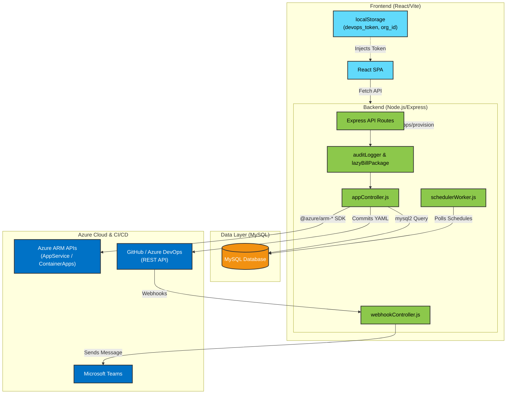
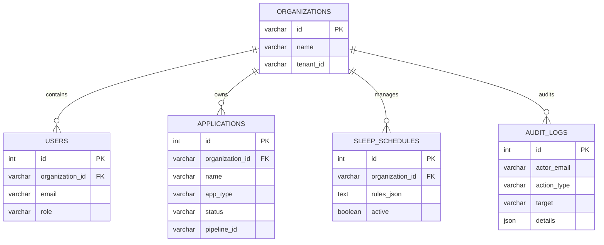
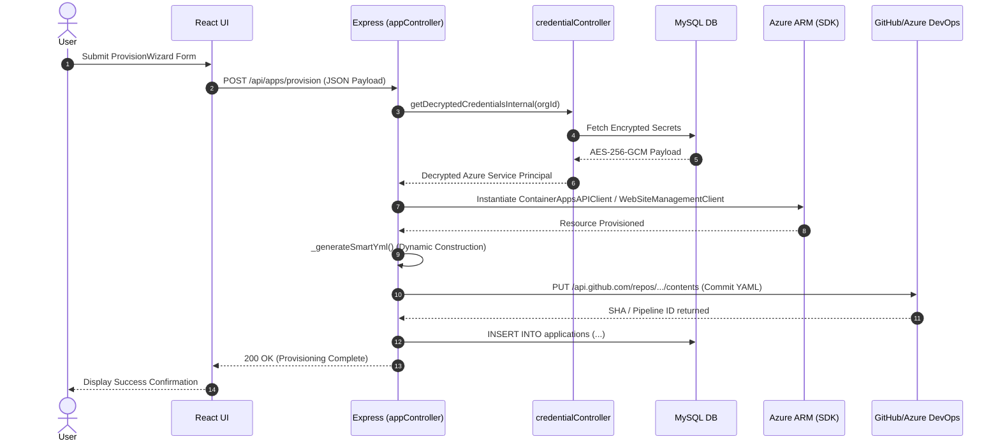
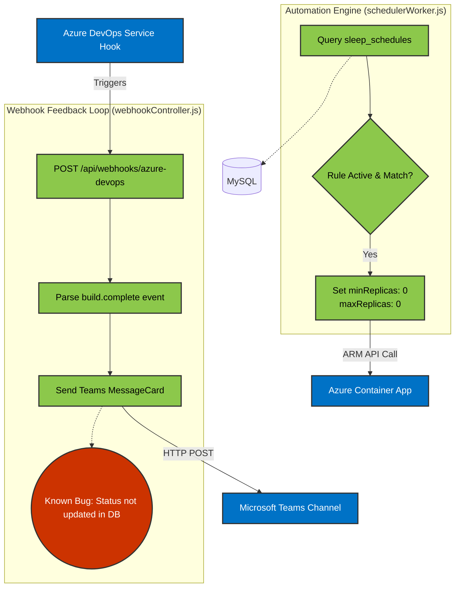
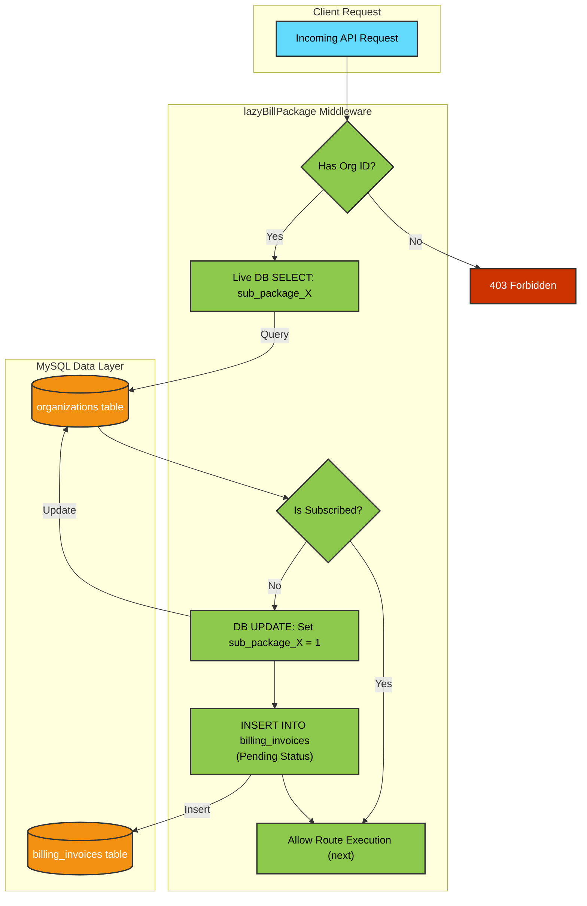
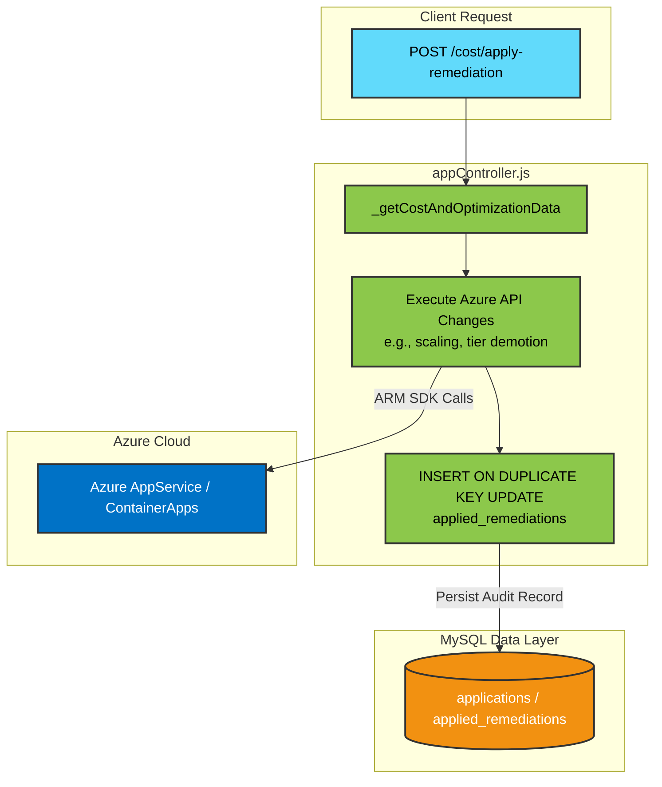

# EvaOps Architecture Diagrams

### 1. High-Level System Architecture

### 2. Multi-Tenant Entity-Relationship Diagram (ERD)

### 3. Application Provisioning & GitOps Sequence

### 4. Automation Engine & Broken Webhook Feedback Loop

### 5. Feature Gating & Auto-Billing (lazyBillPackage)

### 6. Cost Remediation Tracking

